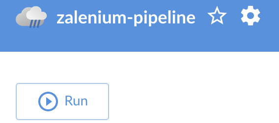

# DevOps Playground Edinburgh: Continuous Testing with Jenkins and Zalenium


## What is already installed on your VM?

In order to get the most out of this session we have pre-installed some components onto the VM. Here is how we created the VMs along with some further reading.

- These are Azure hosted. We created the first VM (with Ubuntu 16.04 OS) using Azure Portal and then used Azure CLI to clone the VM - https://docs.microsoft.com/en-us/azure/virtual-machines/linux/copy-vm
- We installed Java using these instructions - https://www.digitalocean.com/community/tutorials/how-to-install-java-with-apt-get-on-ubuntu-16-04
- We installed Jenkins using these instructions- https://www.digitalocean.com/community/tutorials/how-to-install-jenkins-on-ubuntu-16-04

## Accessing Your Machine

Tonight's Playground will be performed using a command line tool and a web browser.

We will provide you with a machine IP address which is your Ubuntu Virtual Machine (VM) for the duration of tonight's DevOps Playground.

1. To access your machine first open a Terminal/Command window and enter the following command:
`ssh DevOps@your.Ip`

2. You will be asked about whether you wish to proceed, type `yes` and press return.
    
3. You will be prompted for a password. The password for all machines is `Devopsplayground!`. 

You will now be connected to your VM via SSH. The majority of our Playground will be performed using the web browser, but we may need to access this terminal window later in the session.

## Accessing Your Jenkins Instance

1. Jenkins has already been installed and is up and running on your VM. To access Jenkins use the following URL: http://yourVmIp:8080
2. To log in to Jenkins, use the following credentials:

Username: `DevOps`  
Password: `Playground`

## Jenkins Plugins to Install

We are going to install some Plugins for the Playground this evening; **NodeJS** for running the tests, **Allure** for generating reports at the end of the test run and **Blue Ocean** to visualise the Pipeline as it is being run.

1. From the Jenkins home page click on the **Manage Jenkins** button from the menu on the left.  


2. Select **Manage Plugins** from this page.


3. Select the **Available** tab.


4. In the **Filter** bar, search for `NodeJS`.


5. Select the checkbox for **NodeJS**.

6. In the **Filter** bar now search for `Blue Ocean`.

7. Select the checkbox for **Blue Ocean**.

6. In the **Filter** bar now search for `Allure`.

7. Click the **Download now and install after restart** button. This will install **NodeJS** and **Allure** plugins.


8. Select the **Restart Jenkins when installation is complete and no jobs are running** checkbox. Jenkins will now restart.

## Global Tool Configurations

Jenkins restarts occasionally hang in the web browser so you may need to manually navigate to your Jenkins homepage: http://yourVmIp:8080 

1. You will be required to log-in using the same credentials as before.  

Username: `DevOps`  
Password: `Playground`

2. Navigate back to the Jenkins **Dashboard**.

3. Select **Manage Jenkins**. 


4. Select **Global Tool Configuration**.


5. You should see an option for **NodeJS** near the bottom of this page. Select the **Add NodeJS** button.


6. Enter the following credentials:

Name: `node`  
Version: `NodeJS 8.12.0`  
Leave everything else as default.

Press the **Save** button at the bottom of the page.


7. Select back into **Global Tool Configuration** and look for **Allure Commandline** section.

8. Select **Add Allure Commandline**

9. Enter the following credentials:

Name: `allure`   
Version: `2.7.0`  

Press the **Save** button at the bottom of the page.


## Creating a Jenkins Pipeline

1. Navigate back to the Jenkins Dashboard and click on the **Create New Jobs** link.
2. In the 'Enter an item name' at the top of the page type in `zalenium-pipeline`.
3. Select the **Pipeline** option from the options below.
4. Click on the **OK** button at the bottom of the page.


We are now presented with the Jenkins Pipeline configuration page.

## Editing Your Jenkins Pipeline to Checkout Code and Install Dependencies

For the purposes of this evening's Playground we will be editing our pipeline script in the Pipeline script editor in the Jenkins UI.  
**Please note** that better practice would be to have a 'Jenkinsfile' in a repository. This would put your Pipeline script under version control meaning you can track changes and revert to previous versions of the script.  
More information can be found here: https://jenkins.io/doc/book/pipeline/jenkinsfile/  

1. Select the **Pipeline** option in the toolbar at the top of the page.  
  

2. In the Pipeline editor paste in the following code:

```
pipeline {
    agent any
    tools {nodejs 'node'}
    stages {
        stage('Code and Dependencies'){
            parallel{
            stage('Checkout Code'){
                steps{
                    git 'https://github.com/ecsdigital/devopsplayground-edi-9-zaleniumci.git'
                }
            }
            stage('Install Dependencies'){
                steps{
                    sh 'npm install'
                    sh 'npm install wdio-allure-reporter --save-dev'
                    sh 'npm install -g allure-commandline --save-dev'
                    sh 'docker pull elgalu/selenium'
                    sh 'docker pull dosel/zalenium'
                }
            }
        }
        }
    }
}
```

3. Once the code has been pased in then press the **Save** button at the bottom of the page.


## Running Your Jenkins Pipeline

1. On the left hand menu, select **Open Blue Ocean**.

2. Select **zalenium-pipeline**.

3. A pop-up will appear telling you that the job has not been run. Press the **Run** button.


4. Refresh the page and you should see the first run of your Pipeline running.If you click on the job then you will see a visualisation of your Pipeline.


4. The first run will take a bit longer as NodeJS is unpacked on your Jenkins VM and the Zalenium and Selenium Docker images are pulled. After a few minutes, all stages of the Pipeline should be green indicating a success!

Add steps for:

- Checking out code.
- Starting Zalenium
- Installing Node
- Running tests.

## Extending the Pipeline

We now have our Pipeline installing dependencies and checking out the test code from a Git repo in preparation for our tests being run. We now want to add Zalenium into the mix.

1. From **Blue Ocean** select the configure icon from the top right-hand side of the screen. This will take us back to the Pipeline editor view.

 

2. We want to add a Pipeline stage for starting Zalenium and running our tests. Paste the following code into the Pipeline editor:  

```
pipeline {
    agent any
    tools {nodejs 'node'}
    stages {
        stage('Code and Dependencies'){
            parallel{
            stage('Checkout Code'){
                steps{
                    git 'https://github.com/ecsdigital/devopsplayground-edi-9-zaleniumci.git'
                }
            }
            stage('Install Dependencies'){
                steps{
                    sh 'npm install'
                    sh 'npm install wdio-allure-reporter --save-dev'
                    sh 'npm install -g allure-commandline --save-dev'
                    sh 'docker pull elgalu/selenium'
                    sh 'docker pull dosel/zalenium'
                }
            }
            }
        }
            stage ('Start Zalenium'){
                steps{
                    sh 'docker run --rm -ti --name zalenium -d -p 4444:4444 -e PULL_SELENIUM_IMAGE=true -v /var/run/docker.sock:/var/run/docker.sock -v /tmp/videos:/home/seluser/videos --privileged dosel/zalenium start'
                }
            }
            stage ('Run Tests'){
                steps{
                    sh './node_modules/.bin/wdio wdio.conf.js'
                }
            }
            stage ('Stop Zalenium'){
                steps{
                    sh 'docker stop zalenium'
                }
            }
    }
}
```

You can see that two stages have been added to the pipeline.   

**Start Zalenium** which uses our Zalenium start command from the last Playground.  
**Run Tests** which will start our NodeJS tests.  
**Stop Zalenium** which will tear down the Zalenium container at the end of the test run.

3. After pasting in this script, press **Save**.

4. Select **Open Blue Ocean** from the left-hand side menu.

5. Press the **Run** button after opening **Blue Ocean**.

 

You can view the Pipeline being run in BLue Ocean as before. At the end of the run your Blue Ocean should look similar to this:

 

## Reporting Using Allure

We now have tests running in Jenkins using Zalenium as our Grid. Now we want to add some test reports using Allure -  http://webdriver.io/guide/reporters/allure.html.

We have already completed the first part of adding Allure to our WebDriver.io config but now we need to add the Allure step into our Jenkins pipeline to display our reports within Jenkins.

1. From **Blue Ocean** select the configure icon from the top right-hand side of the screen. This will take us back to the Pipeline editor view.

2. Paste in the following Groovy script to your Pipeline Editor:

```
pipeline {
    agent any
    tools {nodejs 'node'}
    stages {
        stage('Code and Dependencies'){
            parallel{
            stage('Checkout Code'){
                steps{
                    git 'https://github.com/ecsdigital/devopsplayground-edi-9-zaleniumci.git'
                }
            }
            stage('Install Dependencies'){
                steps{
                    sh 'npm install'
                    sh 'npm install wdio-allure-reporter --save-dev'
                    sh 'npm install -g allure-commandline --save-dev'
                    sh 'docker pull elgalu/selenium'
                    sh 'docker pull dosel/zalenium'
                }
            }
            }
        }
            stage ('Start Zalenium'){
                steps{
                    sh 'docker run --rm -ti --name zalenium -d -p 4444:4444 -e PULL_SELENIUM_IMAGE=true -v /var/run/docker.sock:/var/run/docker.sock -v /tmp/videos:/home/seluser/videos --privileged dosel/zalenium start'
                }
            }
            stage ('Run Tests'){
                steps{
                    sh './node_modules/.bin/wdio wdio.conf.js'
                }
            }
            stage ('Generate Allure Reports'){
                steps{
                    allure([
                        includeProperties: false,
                        jdk: '',
                        properties: [],
                        reportBuildPolicy: 'ALWAYS',
                        results: [[path: 'allure-results']]
                    ])
                }
            }
            stage ('Stop Zalenium'){
                steps{
                    sh 'docker stop zalenium'
                }
            }
    }
}
```

3. After pasting in the script press **Save**.

4. Select **Open Blue Ocean** from the left-hand side menu.

5. Press the **Run** button after opening **Blue Ocean**.

6. Once the run is complete, your Pipeline should look like the following:

 

7. To access the **Allure** reports, select the **Go To Classic** button at the top right-hand side of the screen.

 

 8. You are now presented with a list of the **Build Artifacts** in the classic Jenkins view. Select the Allure Report button.

 

 9. You can now see the HTML report that **Allure** has generated. This provides you with rhe results of each test.

 