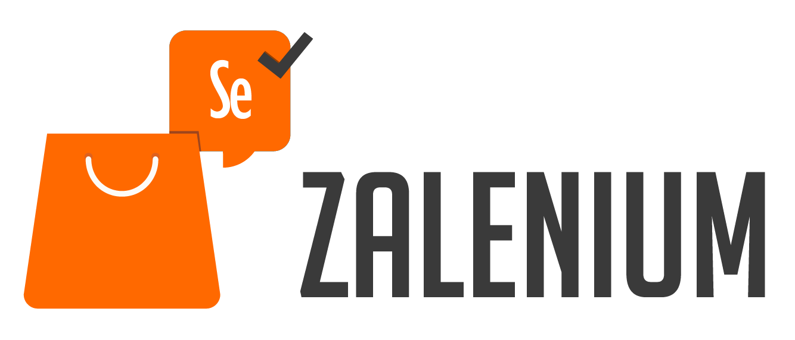

# DevOps Playground Edinburgh: Continuous Testing with Jenkins and Zalenium

## Accessing Your Machine

We will provide you with a machine IP address which is your Ubuntu Virtual Machine (VM) for the duration of tonight's DevOps Playground.

1. To access your machine first open a Terminal/Command window and enter the following command:
    `ssh devops@your.Ip`

2. You will be asked about whether you wish to proceed, type `yes` and press return.
    
3. You will be prompted for a password. The password for all machines is `playground`. 

## Starting Jenkins on Your VM

'Scripts here'

## Creating a Jenkins Pipeline

'Through the UI'

## Running Your Jenkins Pipeline

Add steps for:

- Checking out code.
- Starting Zalenium
- Installing Node
- Running tests.

## Reporting Using Allure

- Generate reports using Allure in Pipeline
- Show the reports.

